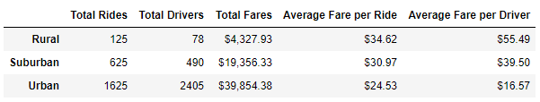

# PyBer Analysis with Pandas and Matplotlib

## Overview of the Pyber Analysis

### Purpose
The purpose of this analysis was to create a summary data frame of the PyBer company's ride-sharing data by city type, and create a multiple-line graph showing the total weekly fares for each city type.

## Results
To create the summary data frame of the ride-sharing data by city type, I first initialized three variables to get the total rides, total drivers, and total fares.

```
total_rides = pyber_data_df.groupby(["type"]).count()["ride_id"]
total_drivers = city_data_df.groupby(["type"]).sum()["driver_count"]
total_fares = pyber_data_df.groupby(["type"]).sum()["fare"]
```

I then calculated the average fare per ride and the average fare per driver for each city type.

```
average_fare_per_ride = total_fares / total_rides
average_fare_per_driver = total_fares / total_drivers
```

I finally created the PyBer summary data frame and formatted the data frame by adding the dollar sign ($) to the columns related to fares and rounding them to two decimal places.

```
pyber_summary_df = pd.DataFrame({
    "Total Rides": total_rides,
    "Total Drivers": total_drivers,
    "Total Fares": total_fares,
    "Average Fare per Ride": average_fare_per_ride,
    "Average Fare per Driver": average_fare_per_driver})

pyber_summary_df.index.name = None

pyber_summary_df["Total Fares"] = pyber_summary_df["Total Fares"].map("${:,.2f}".format)
pyber_summary_df["Average Fare per Ride"] = pyber_summary_df["Average Fare per Ride"].map("${:.2f}".format)
pyber_summary_df["Average Fare per Driver"] = pyber_summary_df["Average Fare per Driver"].map("${:.2f}".format)

pyber_summary_df
```

The output from running the script produces the following data frame:




